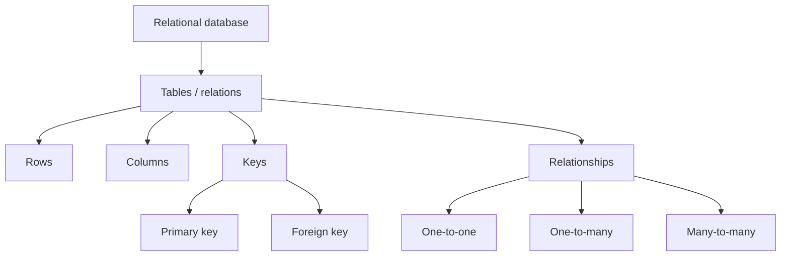
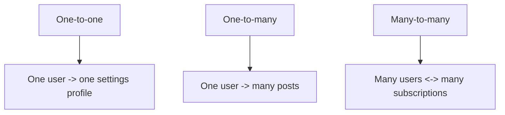

# 01. Database Basics

## Зачем нужен этот модуль

Этот модуль соответствует фундаментальной части трека.

Его задача — дать базовые определения, без которых невозможно дальше нормально понять ни SQL, ни `JOIN`, ни подзапросы.

## Схема

## Что нужно понять

### 1. База данных

База данных — это организованное хранилище данных.

На практике важно понимать:
- база данных хранит данные структурированно;
- данные должны быть пригодны для поиска, изменения и проверки;
- одна и та же предметная область может быть представлена через разные модели данных.

Простой пример:
Представьте социальную сеть. В ней где-то должны храниться профили пользователей, посты, комментарии, лайки и подписки. Все это вместе и есть база данных: не один экран приложения, а внутреннее организованное хранилище того, что видит пользователь.

Подробнее:
- [SQL Academy, Базы данных и СУБД](https://sql-academy.org/ru/guide/basic-database-concepts)

### 2. СУБД

СУБД — это программная система, которая управляет базой данных.

В этом треке основной пример СУБД — `PostgreSQL`.

СУБД отвечает за:
- создание и удаление баз данных;
- хранение таблиц и ограничений;
- выполнение SQL-запросов;
- контроль целостности и транзакций;
- одновременную работу нескольких пользователей.

Простой пример:
Если база данных в соцсети хранит профили и посты, то СУБД похожа на "движок за кулисами", который знает, как сохранить новый пост, как быстро найти нужный профиль и как не сломать данные, когда миллионы людей нажимают кнопки одновременно.

Подробнее:
- [SQL Academy, Базы данных и СУБД](https://sql-academy.org/ru/guide/basic-database-concepts)
- [PostgreSQL Tutorial](https://www.postgresql.org/docs/current/tutorial.html)

### 3. Типы баз данных

Полезно знать, что базы данных бывают разных типов.

На базовом уровне достаточно понимать, что существуют:
- реляционные базы данных;
- key-value базы данных;
- документоориентированные базы данных.

Для этой программы основной интерес представляют именно реляционные базы данных.

Простой пример:
Есть разные способы хранить данные. Например, чат-приложение может быстро искать значение по ключу, а соцсеть обычно хранит много связанных сущностей: пользователей, посты, комментарии, подписки. Нам важен именно такой случай, где данные связаны между собой.

Подробнее:
- [SQL Academy, Типы баз данных](https://sql-academy.org/ru/guide/database-types)

### 4. Реляционная база данных

Реляционная база данных хранит данные в виде отношений.

На практике в учебном контексте это удобно понимать так:
- данные разложены по таблицам;
- таблицы имеют структуру;
- таблицы связаны между собой через ключи.

Простой пример:
Представьте соцсеть. Отдельно хранится таблица пользователей, отдельно таблица постов, отдельно таблица комментариев. Они разделены, но связаны. У поста есть автор, у комментария есть и автор, и пост. Именно так и работает реляционная база.

Подробнее:
- [SQL Academy, Реляционные базы данных](https://sql-academy.org/ru/guide/relation-databases)

### 5. Реляции, строки и столбцы

Таблица — это структура, в которой данные хранятся по строкам и столбцам.

Полезно удерживать простую модель:
- `столбец` описывает тип данных или признак;
- `строка` описывает один конкретный объект;
- `таблица` объединяет объекты одного типа.

В терминах реляционной модели такую таблицу в базовом приближении можно рассматривать как отношение.

Простой пример:
Если у вас есть таблица `users`, то столбцы могут отвечать на вопросы: какой `id` пользователя, какой у него логин, когда создан аккаунт. А каждая строка рассказывает про одного конкретного пользователя соцсети.

Подробнее:
- [SQL Academy, Структура реляционных баз данных](https://sql-academy.org/ru/guide/structure-of-relation-databases)

### 6. Типы данных

У каждого столбца есть тип данных.

Это важно, потому что:
- число, дата и текст обрабатываются по-разному;
- ограничения и запросы зависят от типа;
- ошибка выбора типа осложняет дальнейшую работу.

Простой пример:
Количество подписчиков неудобно хранить как текст `"много"`, если потом нужно сортировать аккаунты по популярности. Для счетчиков нужен числовой тип, для даты публикации нужен тип даты или времени, для имени пользователя нужен текст.

Подробнее:
- [PostgreSQL Data Definition](https://www.postgresql.org/docs/current/ddl.html)

### 7. Ключи

Ключ нужен, чтобы однозначно находить запись или связывать одну таблицу с другой.

На базовом уровне нужно различать:
- `primary key` — однозначный идентификатор строки;
- `foreign key` — ссылка на строку из другой таблицы.

Простой пример:
У каждого пользователя соцсети есть уникальный `id`. Это похоже на `primary key`. А если в таблице постов хранится `author_id`, чтобы понять, кто написал пост, то это уже похоже на `foreign key`.

Подробнее:
- [PostgreSQL Constraints](https://www.postgresql.org/docs/16/ddl-constraints.html)

### 8. Связи в РБД

Связи в РБД показывают, как одна таблица соотносится с другой.

На базовом уровне нужно понимать:
- `one-to-one`;
- `one-to-many`;
- `many-to-many`.

Именно связи превращают набор отдельных таблиц в единую модель данных.

Простой пример:
У одного пользователя может быть много постов. Это `one-to-many`. А пользователь может подписываться на много других пользователей, и на него тоже могут подписываться многие. Это уже похоже на `many-to-many`.

Подробнее:
- [SQL Academy, Структура реляционных баз данных](https://sql-academy.org/ru/guide/structure-of-relation-databases)

Схема видов связей:

### 9. Ограничения

Ограничения задают правила допустимых данных.

Например:
- поле не может быть пустым;
- значение должно быть уникальным;
- ссылка должна вести только на существующую запись.

Простой пример:
Если в соцсети у каждого пользователя должен быть уникальный логин, система не должна позволять двум людям зарегистрировать один и тот же `username`. И если пост обязан иметь автора, нельзя сохранить его без `author_id`.

Подробнее:
- [PostgreSQL Constraints](https://www.postgresql.org/docs/16/ddl-constraints.html)

### 10. Вводная информация о SQL

SQL — это язык, через который пользователь или приложение обращается к реляционной СУБД.

С помощью SQL можно:
- читать данные;
- вставлять данные;
- изменять данные;
- удалять данные;
- создавать таблицы и другие структуры.

Простой пример:
SQL похож на язык коротких команд для внутренней части соцсети: "покажи последние посты этого пользователя", "добавь новый комментарий", "обнови имя профиля", "удали ошибочную запись".

Подробнее:
- [SQL Academy, Вводная информация о SQL](https://sql-academy.org/ru/guide/intro-sql)

### 11. Транзакция

Транзакция объединяет несколько изменений данных в одну логическую операцию.

Смысл в том, что:
- либо выполняются все шаги;
- либо не выполняется ни один.

Это особенно важно там, где данные связаны друг с другом.

Простой пример:
Если пользователь покупает подписку, системе нужно и записать сам платеж, и выдать доступ к функциям. Нельзя сделать только половину действия. Транзакция помогает либо выполнить все шаги вместе, либо отменить их все сразу.

Подробнее:
- [PostgreSQL Transactions](https://www.postgresql.org/docs/15/tutorial-transactions.html)

## Что нужно уметь после модуля

После этого модуля участник должен уметь:
- объяснить разницу между БД и СУБД;
- дать определение РБД;
- объяснить, что такое реляция в учебном приближении;
- объяснить, зачем нужен `primary key`;
- объяснить, зачем нужен `foreign key`;
- объяснить, что такое связь в РБД;
- дать базовое определение SQL-запроса.

## Самопроверка

Проверьте, можете ли вы своими словами ответить на вопросы:
- Чем база данных отличается от СУБД?
- Почему `PostgreSQL` — это СУБД, а не просто база данных?
- Что в учебном контексте понимается под реляцией?
- Зачем нужны `primary key` и `foreign key`?
- Какие базовые типы связей есть в РБД?
