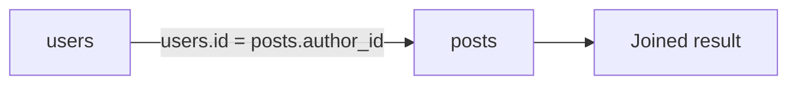
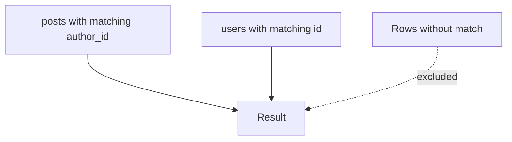
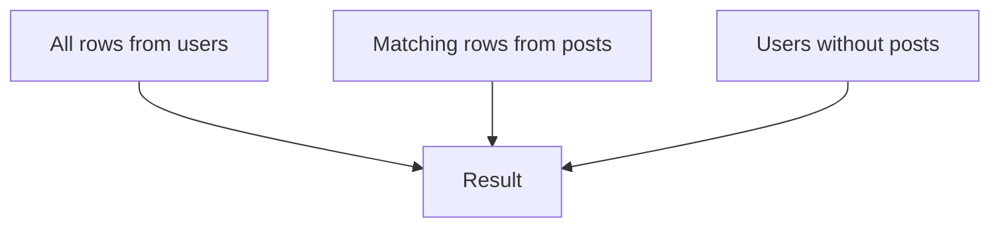
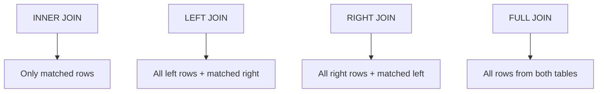
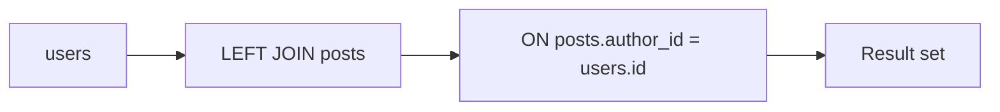

# 03. Joins

## Зачем нужен этот модуль

Этот модуль нужен, чтобы участник понял, как именно данные из разных таблиц собираются в один результат.

После изучения этого модуля `JOIN` не должен восприниматься как сложная магия. Он должен восприниматься как обычный способ связать данные по ключам.

Во всех SQL-примерах ниже используется общий учебный датасет из [00_Mini_Dataset.md](00_Mini_Dataset.md).

## Схема



## Что нужно понять

### 1. Зачем вообще нужны JOIN

В реляционной базе данные почти всегда распределены по нескольким таблицам.

Это делается затем, чтобы:
- не дублировать данные без необходимости;
- хранить сущности раздельно;
- поддерживать связи между сущностями через ключи.

Поэтому, когда нужен итоговый результат, данные приходится собирать обратно через `JOIN`.

Простой пример:
В соцсети отдельно хранится список пользователей, отдельно список постов. Если вы хотите показать в ленте не только текст поста, но и имя автора, нужно "соединить" посты с пользователями.

Подробнее:
- [SQL Academy, INNER JOIN](https://sql-academy.org/ru/guide/inner-join)

SQL-пример:
```sql
SELECT posts.title, users.username
FROM posts
INNER JOIN users ON posts.author_id = users.id;
```

Этот запрос означает:
"Покажи заголовок поста и логин автора".

### 2. Что связывает JOIN

`JOIN` связывает таблицы по условию.

Обычно это условие строится так:
- `primary key` одной таблицы;
- `foreign key` другой таблицы.

Именно поэтому `JOIN` тесно связан с темами:
- ключей;
- связей в РБД;
- структуры реляционной модели.

Простой пример:
Если у поста есть поле `author_id`, а в таблице пользователей есть `id`, то `JOIN` как будто говорит: "сопоставь пост с тем пользователем, который его написал".

SQL-пример:
```sql
SELECT posts.id, posts.title, users.username
FROM posts
INNER JOIN users ON posts.author_id = users.id;
```

Связь строится по условию `posts.author_id = users.id`.

### 3. INNER JOIN

`INNER JOIN` оставляет только те строки, для которых совпадение найдено в обеих таблицах.

Это полезно, когда:
- нужны только корректно связанные данные;
- неинтересны объекты без пары;
- нужно показать только подтвержденные связи.

Простой пример:
Если мы хотим показать только те посты, у которых точно найден автор в таблице пользователей, то `INNER JOIN` подходит лучше всего.

SQL-пример:
```sql
SELECT posts.title, users.username
FROM posts
INNER JOIN users ON posts.author_id = users.id;
```

Если автор не найден, такая строка в результат не попадет.

Схема `INNER JOIN`:



### 4. LEFT JOIN

`LEFT JOIN` оставляет все строки из левой таблицы, даже если совпадение справа не найдено.

Это полезно, когда:
- нужно показать полную выборку основных объектов;
- часть данных еще не связана;
- важно увидеть и связанные, и несвязанные записи.

Простой пример:
Если мы хотим показать всех пользователей, даже тех, у кого пока нет ни одного поста, нужен `LEFT JOIN`.

Подробнее:
- [SQL Academy, OUTER JOIN](https://sql-academy.org/ru/guide/outer-join)
- [PostgreSQL, Joins Between Tables](https://www.postgresql.org/docs/16/tutorial-join.html)

SQL-пример:
```sql
SELECT users.username, posts.title
FROM users
LEFT JOIN posts ON posts.author_id = users.id;
```

Если у пользователя нет постов, `posts.title` будет пустым, но сам пользователь останется в результате.

Схема `LEFT JOIN`:



### 5. RIGHT JOIN и FULL JOIN

Для базового уровня полезно знать, что они существуют.

Но на практике джуну достаточно уверенно понимать:
- `INNER JOIN`
- `LEFT JOIN`

## Как для подростков

Если совсем упростить, представьте две таблицы как два списка:
- список пользователей;
- список постов.

И вы хотите собрать один новый список, где видно и пост, и автора.

### `INNER JOIN`

Берем только те строки, где пара нашлась с обеих сторон.

Простой образ:
Это как список людей и список их аккаунтов на турнире.
Если у человека нет аккаунта, он в итоговый список не попадет.
Если у аккаунта нет нормального владельца, он тоже не попадет.

Запоминаем так:
`INNER JOIN` любит только совпавшие пары.

### `LEFT JOIN`

Берем все строки из левой таблицы, а из правой только то, что подошло.

Простой образ:
У вас есть список всех пользователей приложения.
Вы хотите рядом показать их последний пост.
Если у кого-то поста нет, человек все равно остается в списке, просто поле поста будет пустым.

Запоминаем так:
`LEFT JOIN` говорит: "левую таблицу не выбрасываем вообще".

### `RIGHT JOIN`

Это зеркальный вариант `LEFT JOIN`.

Простой образ:
Если для нас главным стал список постов справа, а пользователи слева, то можно сказать:
"оставь все строки из правой таблицы, а слева подтяни то, что найдется".

Запоминаем так:
`RIGHT JOIN` — это почти тот же `LEFT JOIN`, только важной считается правая таблица.

### `FULL JOIN`

Берем вообще все строки из обеих таблиц.
Если пара есть — соединяем.
Если пары нет — строка все равно остается.

Простой образ:
Вы склеиваете два списка и никого не хотите потерять.
Если пользователь без поста — он остается.
Если пост без нормальной связки — он тоже остается.

Запоминаем так:
`FULL JOIN` — это режим "показать вообще все, даже если часть не совпала".

### Самая короткая шпаргалка

- `INNER JOIN` — только совпадения.
- `LEFT JOIN` — все слева, совпадения справа.
- `RIGHT JOIN` — все справа, совпадения слева.
- `FULL JOIN` — все отовсюду.

### Визуальная шпаргалка по всем типам



### 6. Ошибки при JOIN

Типовые ошибки:
- соединение не по тем полям;
- отсутствие условия соединения;
- дублирование строк из-за неправильной связи;
- попытка соединять данные, не понимая реальной структуры модели.

Простой пример:
Если пытаться соединить посты с пользователями не по `author_id`, а, например, по дате регистрации, результат будет красивым только случайно, но по смыслу неверным.

SQL-пример неправильной логики:
```sql
SELECT posts.title, users.username
FROM posts
INNER JOIN users ON posts.created_at = users.created_at;
```

Такой запрос может вернуть какие-то строки, но это не значит, что связь выбрана правильно.

### 7. Как читать JOIN

При чтении запроса полезно идти по шагам:
1. Какая основная таблица?
2. Какая таблица присоединяется?
3. По какому условию идет соединение?
4. Какие строки останутся после такого типа JOIN?
5. Что окажется в результате?

Мини-пример для разбора:
```sql
SELECT users.username, posts.title
FROM users
LEFT JOIN posts ON posts.author_id = users.id;
```

Здесь:
- основная таблица — `users`;
- присоединенная таблица — `posts`;
- условие связи — `posts.author_id = users.id`;
- в результате будут все пользователи, даже если у них нет постов.

Схема чтения:



## Что нужно уметь после модуля

После этого модуля участник должен уметь:
- объяснить, зачем нужен `JOIN`;
- различать `INNER JOIN` и `LEFT JOIN`;
- понимать, как `JOIN` связан с ключами;
- читать простой запрос с двумя таблицами;
- объяснить, почему неправильный `JOIN` дает неверный результат.

## Самопроверка

Проверьте, можете ли вы:
- объяснить, зачем вообще разбивать данные по разным таблицам;
- показать, какая таблица в запросе является основной;
- объяснить, почему `INNER JOIN` отбрасывает часть строк;
- объяснить, почему `LEFT JOIN` может вернуть `NULL` в полях присоединенной таблицы.
