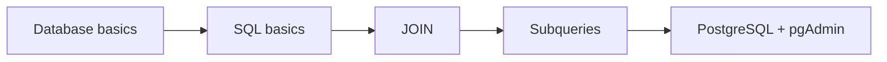

# DataBase Fundamentals

Это отдельный трек развития кандидата, стажера или джуна, который закрывает пробелы в базовых знаниях по реляционным базам данных.

Цель трека:
- дать минимально необходимую теоретическую базу по БД;
- снять риск того, что кандидат проваливает практику не из-за логики задач, а из-за незнания основ SQL и реляционной модели;
- подготовить участника к работе с `PostgreSQL`, `pgAdmin` и заданиями, связанными с `CMDB` и моделированием данных.

Структура трека вдохновлена логикой гайда SQL Academy:
- сначала фундаментальные основы;
- затем базовый синтаксис SQL-запроса;
- затем `JOIN`;
- затем подзапросы;
- после этого локальная практическая привязка к `PostgreSQL` и `pgAdmin`.

Логика трека:
- сначала участник выстраивает понятийную базу;
- затем учится читать SQL как язык запросов;
- затем понимает, как связываются таблицы;
- затем учится читать вложенную логику запросов;
- после этого переносит теорию в локальную работу с `PostgreSQL`.

## Общая схема трека

## Ожидаемый результат обучения

После прохождения трека участник должен понимать следующие определения:
- база данных;
- СУБД;
- РБД;
- реляции и ключи;
- связи в РБД;
- SQL-запрос;
- присоединения в SQL-запросах (`JOIN`);
- подзапросы в SQL-запросах.

## Как проходить

1. Сначала изучите [00_Mini_Dataset.md](00_Mini_Dataset.md), чтобы понимать, на каких таблицах построены все SQL-примеры.
2. Затем изучите [01_Database_Basics.md](01_Database_Basics.md).
3. После этого перейдите к [02_SQL_Basics.md](02_SQL_Basics.md).
4. Затем изучите [03_Joins.md](03_Joins.md).
5. Затем пройдите [04_Subqueries.md](04_Subqueries.md).
6. После этого изучите [05_PostgreSQL_And_pgAdmin.md](05_PostgreSQL_And_pgAdmin.md).
7. В конце используйте [06_Glossary.md](06_Glossary.md) как словарь терминов и итоговую проверку терминов.

## Как понять, что база усвоена

После прохождения трека участник должен быть способен без подсказок:
- объяснить разницу между базой данных и СУБД;
- объяснить, почему реляционная модель опирается на таблицы, ключи и связи;
- прочитать базовый `SELECT` с фильтрацией и сортировкой;
- объяснить, зачем нужен `JOIN` и чем `INNER JOIN` отличается от `LEFT JOIN`;
- объяснить, что такое подзапрос и как читать его изнутри наружу;
- объяснить, что именно локально разворачивается при работе с `PostgreSQL` и `pgAdmin`.

## Для кого это обязательно

Этот трек особенно полезен, если участник:
- не работал раньше с `PostgreSQL`;
- знает Jira, но слабо знает SQL;
- путает `таблицу`, `сущность`, `ключ`, `связь`, `constraint`;
- неуверенно чувствует себя в темах `JOIN`, `PK`, `FK`, `subquery`, `transactions`.

## Состав

- [00_Mini_Dataset.md](00_Mini_Dataset.md) — общий учебный датасет для всех SQL-примеров
- [01_Database_Basics.md](01_Database_Basics.md) — БД, СУБД, типы БД, РБД, реляции, структура реляционной базы и вводная информация о SQL
- [02_SQL_Basics.md](02_SQL_Basics.md) — базовый синтаксис SQL-запроса и чтение простых запросов
- [03_Joins.md](03_Joins.md) — присоединения в SQL и их смысл
- [04_Subqueries.md](04_Subqueries.md) — подзапросы и их чтение
- [05_PostgreSQL_And_pgAdmin.md](05_PostgreSQL_And_pgAdmin.md) — локальный контекст PostgreSQL и pgAdmin
- [06_Glossary.md](06_Glossary.md) — итоговый словарь обязательных определений

## Принцип оформления

Во всех файлах этого трека:
- сначала дается короткая теория;
- затем дается простой практический пример;
- затем фиксируется ожидаемый результат по модулю;
- затем идет короткая самопроверка;
- ссылки расположены рядом с темой, к которой они относятся;
- материалы подходят для самостоятельного изучения.
