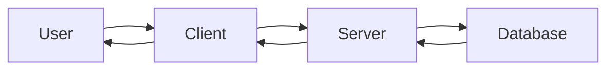
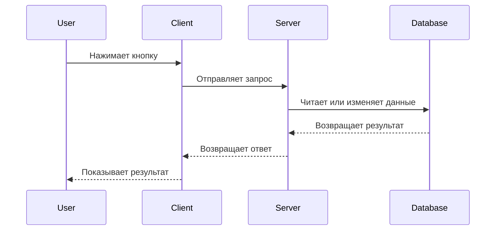

# 01. Client-Server Architecture

## Зачем нужен этот модуль

Этот модуль дает базовое понимание того, как вообще устроено большинство сайтов и интернет-сервисов.

Без этого сложно понимать:
- куда уходит действие пользователя;
- где хранится логика;
- где лежат данные;
- почему браузер сам по себе не "знает" все о приложении.

## Схема

## Что нужно понять

### 1. Что такое клиент-серверная архитектура

Клиент-серверная архитектура — это модель взаимодействия, в которой одна часть системы отправляет запрос, а другая принимает его, обрабатывает и возвращает ответ.

В базовом виде здесь участвуют:
- клиент;
- сервер;
- база данных.

Простой пример:
Вы открываете приложение социальной сети на телефоне. Телефон показывает вам интерфейс, но сам по себе не хранит всю социальную сеть целиком. Он обращается к серверу, получает данные и показывает результат.

### 2. Что такое клиент

Клиент — это программа, через которую пользователь взаимодействует с системой.

Это может быть:
- браузер;
- мобильное приложение;
- desktop-приложение;
- другой сервис.

Простой пример:
Когда вы открываете сайт в `Chrome` или `Safari`, именно браузер в этот момент работает как клиент.

### 3. Что такое сервер

Сервер — это часть системы, которая принимает запросы, выполняет логику и возвращает ответы.

Сервер обычно отвечает за:
- обработку действий пользователя;
- выполнение бизнес-логики;
- проверку прав доступа;
- работу с базой данных.

Простой пример:
Когда вы нажимаете кнопку "Подписаться" в социальной сети, клиент только отправляет запрос. Решение, можно ли выполнить это действие, кто кому подпишется и что вернуть в ответ, принимает уже сервер.

### 4. Что такое база данных в этой схеме

База данных нужна для хранения данных системы.

Именно там обычно лежат:
- пользователи;
- посты;
- комментарии;
- подписки;
- настройки;
- история действий.

Простой пример:
Если пользователь написал пост вчера, а вы открыли приложение сегодня и снова его видите, значит этот пост был где-то сохранен. Обычно он хранится в базе данных.

### 5. Как идет взаимодействие

В базовом виде процесс выглядит так:
1. клиент отправляет запрос;
2. сервер получает запрос;
3. сервер выполняет нужную логику;
4. если нужно, сервер читает или изменяет данные в базе;
5. сервер возвращает клиенту ответ.

Схема процесса:

Простой пример:
Вы открываете страницу профиля.
Клиент отправляет запрос.
Сервер понимает, какой профиль нужен.
Сервер берет данные из базы.
Сервер отправляет ответ.
Клиент показывает страницу.

### 6. Почему это важно разработчику

Даже если специалист не пишет backend, ему все равно важно понимать:
- что интерфейс не существует отдельно от сервера;
- что не все данные рождаются в браузере;
- что кнопка в интерфейсе обычно запускает сетевое взаимодействие;
- что ошибки могут возникать на разных уровнях.

Простой пример:
Если в интерфейсе не загрузились данные, проблема может быть не в кнопке и не в верстке, а в том, что сервер вернул ошибку или база не отдала нужную информацию.

## Что нужно уметь после модуля

После этого модуля участник должен уметь:
- объяснить, что такое клиент-серверная архитектура;
- различать клиента, сервер и базу данных;
- объяснить, в какой момент клиент отправляет запрос;
- объяснить, зачем серверу нужна база данных;
- описать базовый путь запроса от клиента до ответа.

## Самопроверка

Проверьте, можете ли вы:
- объяснить, почему браузер является клиентом;
- объяснить, зачем приложению нужен сервер;
- объяснить, где обычно хранятся данные приложения;
- своими словами описать путь "клиент -> сервер -> база данных -> сервер -> клиент".
