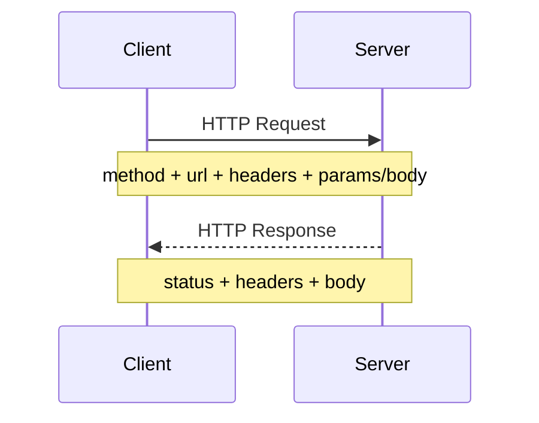
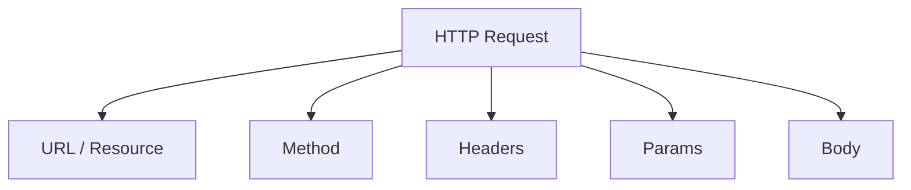
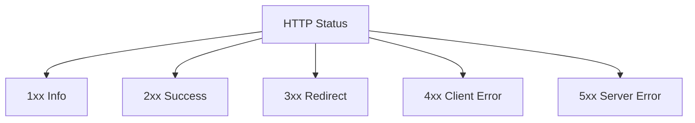

# 02. HTTP Basics

## Зачем нужен этот модуль

Этот модуль нужен, чтобы участник понимал, как именно клиент и сервер обмениваются данными в вебе.

Если в предыдущем модуле мы разобрали общую модель взаимодействия, то здесь разбираем язык этого взаимодействия.

## Схема

## Что нужно понять

### 1. Что такое HTTP

HTTP — это протокол передачи данных между клиентом и сервером.

Именно через него браузер или приложение:
- запрашивает страницы;
- отправляет данные;
- получает ответы;
- узнает об ошибках и успешных результатах.

Простой пример:
Когда вы открываете страницу сайта, ваш браузер отправляет HTTP-запрос, а сервер в ответ присылает данные страницы.

### 2. Что такое HTTP-запрос и HTTP-ответ

HTTP-запрос — это сообщение от клиента к серверу.

HTTP-ответ — это сообщение от сервера к клиенту.

Простой пример:
Клиент говорит:
"Покажи мне страницу профиля пользователя".

Сервер отвечает:
"Вот страница" или "Такой пользователь не найден".

### 3. Компоненты HTTP-запроса

В базовом виде HTTP-запрос включает:
- ссылку на ресурс;
- метод;
- заголовки;
- параметры;
- тело.

Схема запроса:

Простой пример:
Если вы отправляете форму входа в приложение, запрос может содержать:
- адрес сервиса входа;
- метод `POST`;
- заголовки;
- данные логина и пароля в теле запроса.

### 4. Что такое ссылка на ресурс

Ссылка на ресурс показывает, к чему именно обращается клиент.

Обычно в ней есть:
- протокол;
- домен;
- путь к ресурсу;
- иногда порт и параметры.

Простой пример:
`https://example.com/profile`

Такой адрес помогает серверу понять, какой именно ресурс хочет получить клиент.

### 5. Что такое HTTP-метод

Метод показывает, какое действие хочет выполнить клиент.

На базовом уровне нужно понимать:
- `GET` — получить данные;
- `POST` — создать новые данные;
- `PATCH` — частично изменить данные;
- `PUT` — полностью заменить данные или создать их при определенном условии;
- `DELETE` — удалить данные.

Простой пример:
- открыть страницу профиля — это обычно `GET`;
- создать новый комментарий — это обычно `POST`;
- изменить описание профиля — это часто `PATCH`;
- удалить комментарий — это `DELETE`.

### 6. Что такое заголовки, параметры и тело

Заголовки передают служебную информацию о запросе.

Параметры часто передаются в адресной строке и помогают уточнить запрос.

Тело запроса передает основные данные, если нужно что-то создать или изменить.

Простой пример:
Поисковый запрос в строке браузера может передавать текст поиска в параметре.
А запрос на вход в систему обычно передает логин и пароль в теле запроса.

### 7. Что такое HTTP-ответ и код состояния

HTTP-ответ кроме данных часто содержит код состояния.

Код состояния помогает понять, чем закончился запрос.

На базовом уровне нужно понимать группы:
- `1xx` — информационные;
- `2xx` — успешные;
- `3xx` — перенаправления;
- `4xx` — ошибка со стороны клиента;
- `5xx` — ошибка на стороне сервера.

Схема категорий статусов:

Простой пример:
- `200` — запрос успешно обработан;
- `404` — ресурс не найден;
- `500` — на сервере произошла ошибка.

### 8. Что такое HTTPS

HTTPS — это HTTP с шифрованием.

Для базового понимания важно знать:
- логика обмена остается той же;
- данные передаются безопаснее;
- в реальной работе чаще встречается именно `HTTPS`.

Простой пример:
Если вы вводите пароль на сайте, ожидается, что он передается через защищенное соединение, а не в открытом виде.

### 9. Почему это важно разработчику

Даже базовому специалисту полезно понимать:
- какой запрос отправляет интерфейс;
- что реально ушло на сервер;
- что именно вернул сервер;
- как различать успешный ответ и ошибку.

Простой пример:
Если кнопка "Сохранить" визуально нажимается, но данные не сохранились, нужно проверять не только интерфейс, но и HTTP-запрос, метод, тело и код ответа.

## Что нужно уметь после модуля

После этого модуля участник должен уметь:
- объяснить, что такое HTTP;
- различать запрос и ответ;
- назвать основные компоненты HTTP-запроса;
- объяснить назначение методов `GET`, `POST`, `PATCH`, `PUT`, `DELETE`;
- объяснить, зачем нужен код состояния;
- объяснить разницу между HTTP и HTTPS на базовом уровне.

## Самопроверка

Проверьте, можете ли вы:
- объяснить, что браузер отправляет на сервер при открытии страницы;
- назвать части HTTP-запроса;
- объяснить, когда нужен `GET`, а когда `POST`;
- объяснить, что означает код ответа `404`;
- объяснить, зачем нужен `HTTPS`.
