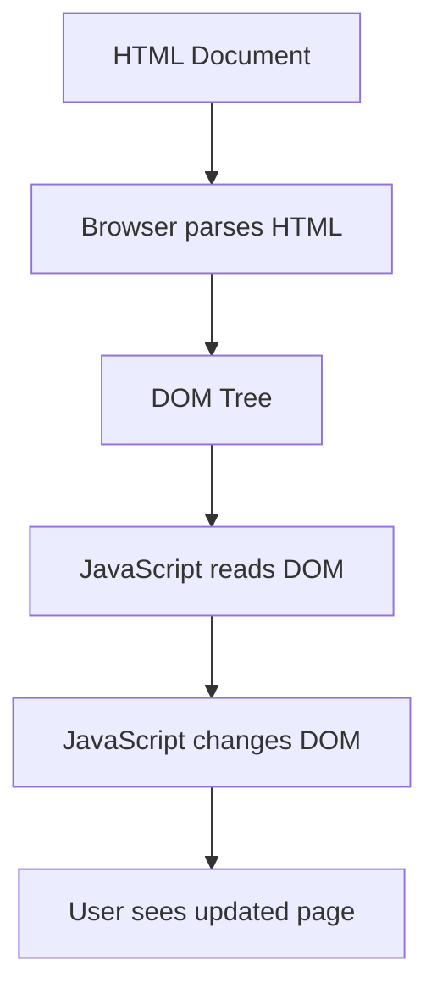
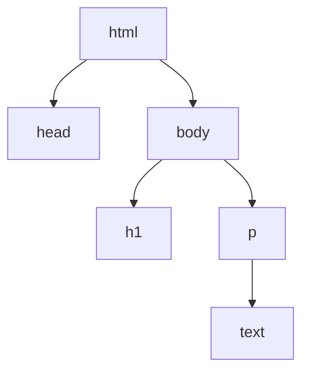
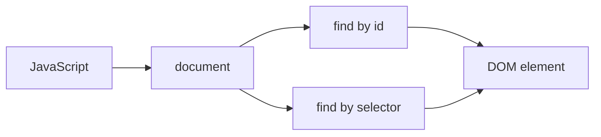

# 03. DOM Basics

## Зачем нужен этот модуль

Этот модуль нужен, чтобы участник понимал, как браузер представляет HTML-страницу в памяти и как JavaScript получает доступ к содержимому страницы.

Это базовая тема для любой дальнейшей работы с интерфейсами.

## Схема

## Что нужно понять

### 1. HTML-документ и страница в браузере

Когда браузер загружает страницу, он получает HTML-документ.

Но дальше браузер не просто "хранит текст".
Он превращает документ во внутреннюю структуру объектов.

Простой пример:
Если в HTML есть заголовок, абзац и кнопка, браузер не воспринимает это просто как набор букв. Он строит структуру, где каждый элемент страницы становится отдельным объектом.

### 2. Что такое DOM

DOM — это объектная модель документа.

Проще говоря:
- браузер строит дерево объектов;
- каждый HTML-тег становится узлом;
- вложенные элементы становятся дочерними узлами;
- текст внутри элементов тоже становится частью структуры.

Простой пример:
Если внутри `body` лежит `h1`, а под ним `p`, то в DOM это будет структура, где `body` является родителем, а `h1` и `p` — его детьми.

### 3. Почему DOM похож на дерево

DOM обычно удобно представлять как дерево.

Это важно, потому что:
- у элементов есть родители;
- у элементов есть дети;
- элементы вложены друг в друга;
- к нужному элементу можно добраться по структуре документа.

Мини-схема дерева:

Простой пример:
Внутри карточки товара может быть заголовок, картинка и кнопка.
Карточка — родитель.
Ее внутренние части — дочерние элементы.

### 4. Как JavaScript работает с DOM

JavaScript может обращаться к объектам DOM и изменять их.

Например, JavaScript может:
- найти элемент;
- прочитать его текст;
- изменить текст;
- изменить стиль;
- скрыть элемент;
- добавить новый элемент.

Простой пример:
Когда вы нажимаете кнопку "Показать еще", JavaScript может изменить DOM так, чтобы на странице появились новые элементы.

### 5. Идентификаторы и поиск элементов

У элементов могут быть идентификаторы и другие признаки, по которым их можно найти.

На базовом уровне важно понимать:
- если у элемента есть `id`, к нему можно обратиться адресно;
- JavaScript может искать элементы по селекторам и идентификаторам.

Схема поиска элемента:

Простой пример:
Если у заголовка есть `id="title"`, скрипт может найти именно этот элемент и поменять его текст.

### 6. Что происходит при изменении DOM

Когда JavaScript меняет DOM, пользователь видит изменения на странице.

Это может быть:
- смена текста;
- смена цвета;
- появление нового блока;
- удаление старого блока;
- скрытие или показ элемента.

Простой пример:
Если скрипт поменял текст кнопки с "Подписаться" на "Вы подписаны", это значит, что он изменил соответствующий элемент в DOM.

### 7. Почему это важно разработчику

Даже если специалист не пишет сложный frontend, ему важно понимать:
- что страница в браузере — это не просто статичный HTML;
- что поведение интерфейса связано с DOM;
- что JavaScript работает не "по экрану", а по объектной модели документа.

Простой пример:
Если пользователь жалуется, что кнопка не меняет состояние после нажатия, проблема может быть в коде, который должен был изменить DOM, но не сделал этого.

## Что нужно уметь после модуля

После этого модуля участник должен уметь:
- объяснить, что такое DOM;
- объяснить, почему DOM представляют как дерево;
- объяснить, что HTML-элементы становятся объектами;
- объяснить, как JavaScript находит и изменяет элементы страницы;
- объяснить, почему изменение DOM меняет интерфейс.

## Самопроверка

Проверьте, можете ли вы:
- объяснить, что браузер делает с HTML после загрузки;
- объяснить, почему `body`, `h1` и `p` можно представить как дерево;
- объяснить, как JavaScript может изменить текст элемента;
- объяснить, почему изменение DOM видно пользователю.
