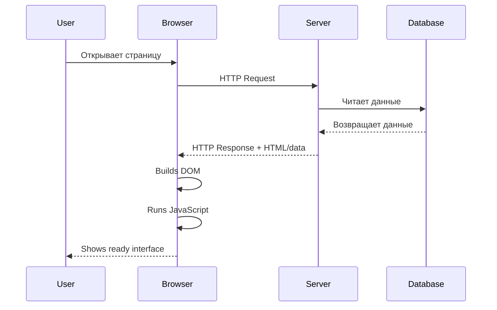
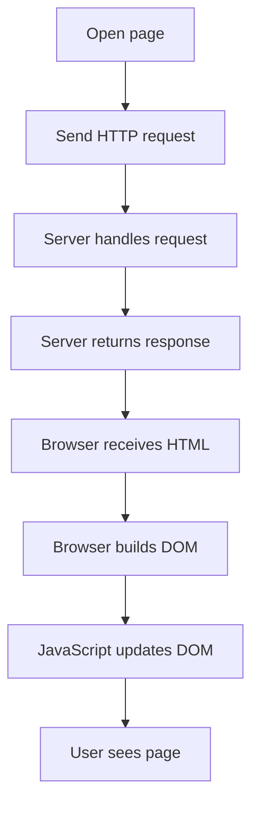
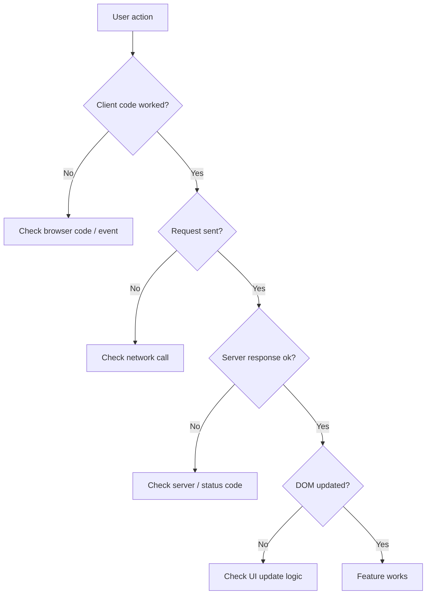

# 04. How Web Page Works

## Зачем нужен этот модуль

Этот модуль связывает вместе все предыдущие темы.

Его цель — показать одну цельную картину:
- клиент;
- сервер;
- HTTP;
- HTML;
- DOM;
- JavaScript.

## Схема

## Что нужно понять

### 1. Как открывается страница

Когда пользователь открывает страницу:
1. клиент отправляет HTTP-запрос;
2. сервер получает его и обрабатывает;
3. сервер возвращает ответ;
4. браузер получает HTML;
5. браузер строит DOM;
6. JavaScript при необходимости меняет DOM;
7. пользователь видит готовый интерфейс.

Схема по шагам:

Простой пример:
Вы открываете страницу профиля в браузере.
Браузер отправляет запрос на сервер.
Сервер возвращает HTML и другие данные.
Браузер строит страницу.
Скрипты загружают дополнительную информацию и обновляют DOM.

### 2. Где заканчивается сервер и начинается браузер

Сервер отвечает за:
- обработку запроса;
- проверку логики;
- получение данных;
- формирование ответа.

Браузер отвечает за:
- получение ответа;
- отображение страницы;
- построение DOM;
- выполнение JavaScript на стороне клиента.

Простой пример:
Сервер знает, кто автор поста и какие у него данные.
Браузер знает, как показать это пользователю на экране.

### 3. Как одно действие пользователя запускает целую цепочку

Даже простое действие в интерфейсе может включать несколько слоев:
- клик по кнопке;
- запуск JavaScript;
- HTTP-запрос;
- обработка на сервере;
- ответ;
- изменение DOM.

Простой пример:
Пользователь нажимает кнопку "Лайк".
JavaScript отправляет запрос.
Сервер сохраняет лайк.
Сервер возвращает успешный ответ.
JavaScript обновляет счетчик лайков в DOM.

### 4. Где искать проблему, если что-то не работает

Проблема может быть на разных уровнях:
- кнопка нажимается, но обработчик не срабатывает;
- запрос не отправился;
- сервер вернул ошибку;
- данные пришли, но DOM не обновился;
- данные в базе не сохранились.

Схема поиска проблемы:

Простой пример:
Если после нажатия "Сохранить" ничего не поменялось, нужно проверять:
- сработал ли код на клиенте;
- ушел ли HTTP-запрос;
- что вернул сервер;
- изменился ли DOM после ответа.

## Что нужно уметь после модуля

После этого модуля участник должен уметь:
- описать полный путь загрузки страницы;
- объяснить, как связаны клиент, сервер и HTTP;
- объяснить, как HTML превращается в DOM;
- объяснить, почему JavaScript часто меняет интерфейс через DOM;
- объяснить, на каких уровнях могут возникать ошибки.

## Самопроверка

Проверьте, можете ли вы:
- по шагам объяснить, что происходит после открытия страницы в браузере;
- объяснить, где используется HTTP;
- объяснить, в какой момент появляется DOM;
- объяснить, почему после ответа сервера интерфейс может измениться.
