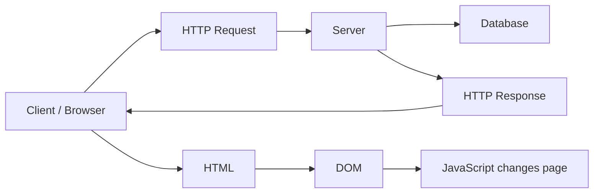

# Developers Theory Fundamentals

Это отдельный теоретический трек для кандидата, стажера или джуна.

Его задача:
- дать базовые понятия, без которых сложно понимать работу веб-приложений;
- выровнять минимальный технический словарь будущего специалиста;
- подготовить участника к дальнейшей работе с интерфейсами, API, браузером и клиент-серверным взаимодействием.

Трек построен на основе трех исходных материалов:
- `Клиент-серверная архитектура`
- `Протокол HTTP`
- `DOM`

## Общая схема трека

## Что должен понять участник

После прохождения трека участник должен понимать:
- что такое клиент и сервер;
- как клиент, сервер и база данных взаимодействуют между собой;
- что такое HTTP-запрос и HTTP-ответ;
- какие компоненты есть у HTTP-запроса;
- зачем нужны HTTP-методы `GET`, `POST`, `PATCH`, `PUT`, `DELETE`;
- что такое HTTP-статус и почему он важен;
- что такое HTML-документ;
- что такое DOM;
- как JavaScript получает доступ к DOM и меняет страницу.

## Как проходить

1. Сначала изучите [01_Client_Server_Architecture.md](01_Client_Server_Architecture.md).
2. Затем перейдите к [02_HTTP_Basics.md](02_HTTP_Basics.md).
3. После этого изучите [03_DOM_Basics.md](03_DOM_Basics.md).
4. Затем пройдите [04_How_Web_Page_Works.md](04_How_Web_Page_Works.md).
5. В конце используйте [05_Glossary.md](05_Glossary.md) как итоговый словарь терминов.

## Состав

- [01_Client_Server_Architecture.md](01_Client_Server_Architecture.md) — клиент, сервер, база данных и логика их взаимодействия
- [02_HTTP_Basics.md](02_HTTP_Basics.md) — базовые понятия HTTP, запросы, ответы, методы и статусы
- [03_DOM_Basics.md](03_DOM_Basics.md) — HTML-документ, DOM и связь с JavaScript
- [04_How_Web_Page_Works.md](04_How_Web_Page_Works.md) — как клиент-серверная архитектура, HTTP и DOM соединяются в одном процессе
- [05_Glossary.md](05_Glossary.md) — итоговый словарь базовых терминов

## Принцип оформления

Во всех файлах этого трека:
- сначала дается короткая теория;
- затем дается простой практический пример;
- затем фиксируется ожидаемый результат по модулю;
- затем идет короткая самопроверка;
- материалы подходят для самостоятельного изучения.
